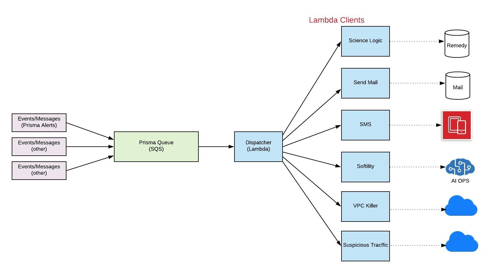

# The following is an overall depiction of Prisma Alerts integration

Diagram

The architectural components of the integration are:

	
* Prisma Alerts - Alert rules define which policy violations trigger an alert in a selected set of cloud accounts. The alert rule is configured and sends the Alert Payload that the rule triggers to the Prisma Queue.

* Prisma Queue - A service that sits between Prisma and the Dispatcher. Any interaction with Events/Messages goes through this service. There is only one instance of the SQS queue running at any one time. The primary purpose for this is so any clients that might be interested in changes to Events\Messages can be notified.

* Dispatcher - A dispatcher is a [command pattern](https://en.wikipedia.org/wiki/Command_pattern) used to invoke other functions and services. It knows which functions to invoke in response to Events\Message and how to call those Lambda functions.  It reduces coupling between components.
	
* Clients – The entity that carries out the required processing.

Shown above, this design implements a [messaging pattern](https://en.wikipedia.org/wiki/Messaging_pattern). It allows the building of a scalable and robust system by decoupling functions and services from direct dependence on one another and allowing storage of events/messages in a queue. The reliability comes from the fact that if the consuming service goes offline, messages are retained in the queue and can still be processed later. It features a message queue with a sender that can post to the queue and a receiver that can retrieve messages from the queue (AWS SQS). The Dispatcher directly [integrates](https://docs.aws.amazon.com/AWSSimpleQueueService/latest/SQSDeveloperGuide/sqs-configure-lambda-function-trigger.html) with SQS; therefore, the Dispatcher is invoked when a new event\message is triggered.  A vital benefit of the design is that making future changes is easier because of less coupling between functions, which makes it more scalable.