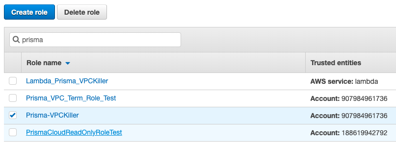

# VPC Terminator
AWS Lambda Function for cleanup VPC Resouce in Non Virginia Region. 
Required integration with Prisma Cloud, with Policy Query:

```
config where cloud.type = 'aws' AND cloud.region != 'AWS Virginia' AND api.name = 'aws-ec2-describe-vpcs' AND json.rule = state equals "available"
```
Alert Use AWS SQS to triger cleanup.

## Requirements
AWS command line 2.0
### How to cleanup VPC on a new AWS account
To Cleanup VPC on a new AWS account, you need to apply the terrmintor role on the new AWS account.
1. Set the AWS Access Key and Secret Key using the **new account** as your environement variable.
    * macOS and Linux:
    ```
    export AWS_ACCESS_KEY_ID="xxxxxxxxxx"
    export AWS_SECRET_ACCESS_KEY="xxxxxxxxxx"
    export AWS_SESSION_TOKEN="xxxxxxxxxx"
    ```

    * Windows:
    ```
    SET AWS_ACCESS_KEY_ID="xxxxxxxxxx"
    SET AWS_SECRET_ACCESS_KEY="xxxxxxxxxx"
    SET AWS_SESSION_TOKEN="xxxxxxxxxx"
    ```

2.  Go to the directory of this repo in your command line tool, or terminal
    Apply the following command to create the role in the new account:
    ```
    aws cloudformation deploy --template-file Prisma-VPC-Term-Role.yaml  --stack-name Prisma-VPC-Terminator-Role  --capabilities CAPABILITY_NAMED_IAM
    ```
    The command create a Prisma-VPC-Terminator-Role which enable VPCKiller to clean up non-Virginia region

3. After you applying the policy, you should see the the Prisma-VPC-Term-Role has been created in the new account:

    Prisma-VPC-Term-Role on new account:

    
